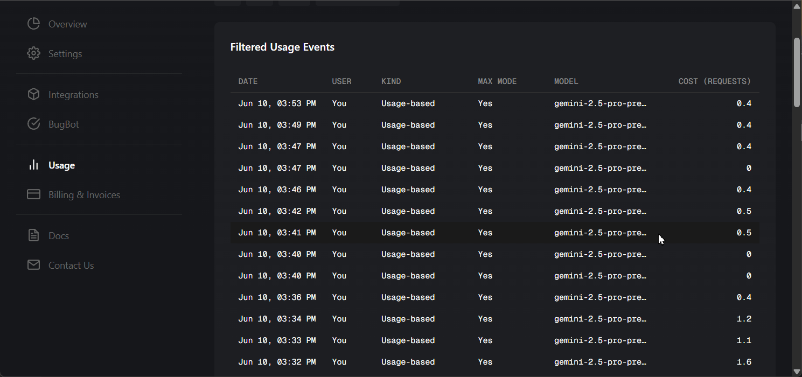

# Cursor Usage Enhancer

A simple Tampermonkey userscript that supercharges the [Cursor](https://cursor.com) Usage dashboard with essential cost-tracking features.

Before and after:

## Features

-   **Visible Cost Column:** Unhides the cost for each usage event and displays it in a clean "Cost ($)" column, so you don't have to hover over tooltips to see it.
-   **Interactive Hourly Chart:** Adds an interactive chart that visualizes your usage costs by the hour, helping you spot spending patterns instantly.
-   **Dynamic Summary:** Provides a clear summary line that shows the total cost and date/time range for the usage events currently visible in the table.

## Installation

1.  Get a userscript manager. A popular one is [**Tampermonkey**](https://www.tampermonkey.net/) (available for Chrome, Firefox, Safari, and Edge).
2.  Click the link below to install the script: [**>> Install Cursor Usage Enhancer <<**](https://raw.githubusercontent.com/Elevate-Code/cursor-usage-costs-userscript/master/cursor-usage.user.js)
3.  Your userscript manager will open and ask you to confirm the installation. Just click "Install" and refresh the Usage page. The script will automatically run when you visit the Cursor dashboard.
4.  Fallback: If the link doesn't prompt an install, copy the script's code, open the Tampermonkey dashboard, create a new script, paste the code in and save it.

## Development & Issues

Found a bug or have a feature request? Please [open an issue](https://github.com/Elevate-Code/cursor-usage-costs-userscript/issues) on our GitHub page. We welcome all feedback and contributions!

## License

This project is licensed under the MIT License. See the [LICENSE](LICENSE) file for details.

_A project by [Elevate Code](https://elevatecode.io)._