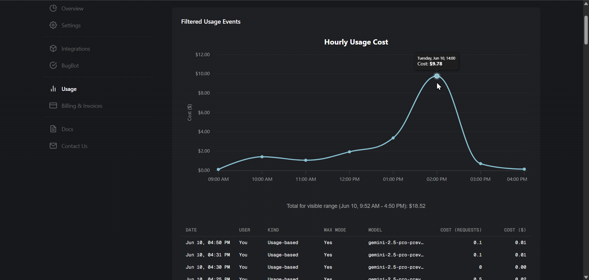

# Cursor Usage Enhancer

A simple Tampermonkey userscript that supercharges the Cursor [Usage dashboard](https://www.cursor.com/dashboard?tab=usage) with essential cost-tracking and value-analysis features.

Before and after:

## Features

-   **Cost-Value Analysis Chart:** Adds an interactive chart that visualizes both your usage-based "overage" costs and the "included" value you're getting from your Pro plan, helping you understand your spending and subscription value at a glance.
-   **Detailed Cost Summary:** Provides a clear summary line showing total overage costs and included value for the currently visible date range.

## Installation

1.  Get a userscript manager. A popular one is [**Tampermonkey**](https://www.tampermonkey.net/) (available for Chrome, Firefox, Safari, and Edge).
2.  Click the link below to install the script: [**>> Install Cursor Usage Enhancer <<**](https://raw.githubusercontent.com/Elevate-Code/cursor-usage-costs-userscript/master/cursor-usage.user.js)
3.  Your userscript manager will open and ask you to confirm the installation. Just click "Install" and refresh the Usage page. The script will automatically run when you visit the Cursor dashboard.
4.  Fallback: If the link doesn't prompt an install, copy the script's code, open the Tampermonkey dashboard, create a new script, paste the code in and save it.

## Development & Issues

Found a bug or have a feature request? Please [open an issue](https://github.com/Elevate-Code/cursor-usage-costs-userscript/issues) on our GitHub page. We welcome all feedback and contributions!

## License

This project is licensed under the MIT License. See the [LICENSE](LICENSE) file for details.

_A project by [Elevate Code](https://elevatecode.io)._